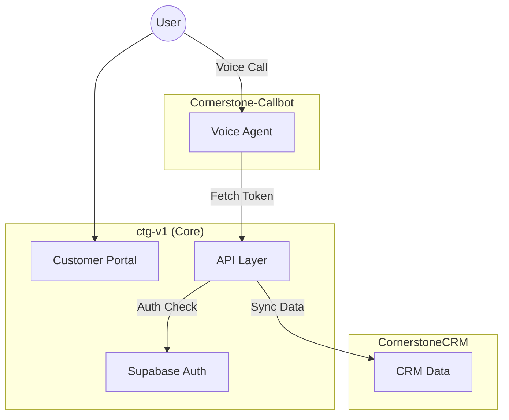

# Project Relationships & Ecosystem

This document outlines the architectural relationships between the projects in the Cornerstone Technology Group ecosystem.

**Last Updated:** (Automated via GitHub Action)

## Ecosystem Overview

### 1. Cornerstone Technology Group (`ctg-v1`)
**Role:** Central Hub / Portal / API Layer
- **Description:** The main web application and API provider. Handles user authentication (Supabase), subscription billing (Stripe), and provides the API endpoints for voice agents.
- **Key Responsibilities:**
  - Customer Portal (`portal.cstg.ai`)
  - Voice Token Generation (`/api/voice/token`)
  - Webhooks for TwiML handling (`/api/test-call/voice-handler`)

### 2. Cornerstone-Callbot
**Role:** Voice AI Application / Consumer
- **Description:** A dedicated project for Voice AI logic, often containing specific bot configurations or Retell AI integrations.
- **Relationship:**
  - **Consumer:** Consumes APIs from `ctg-v1` for authentication or context.
  - **Dependency:** Relies on `ctg-v1` for CORS policies (`lib/cors.ts` allows `app.cstg.ai`).

### 3. CornerstoneCRM
**Role:** Customer Relationship Management
- **Description:** Manages lead and customer data.
- **Relationship:**
  - **Integration:** Likely receives data from `ctg-v1` via webhooks (e.g., new user signups, subscription events) or providing data to agents.

## Data Flow Diagram

## Update Policy
This document is automatically updated with a timestamp on every push to the `master` branch to ensure tracking of changes.
